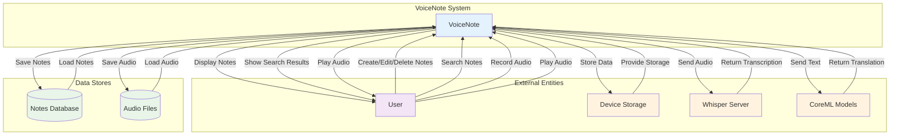
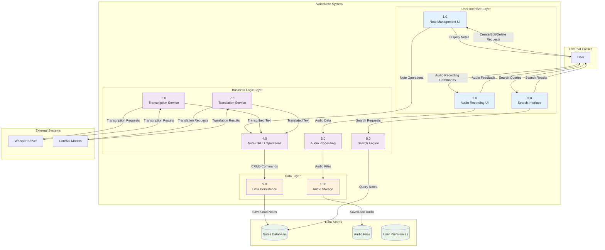
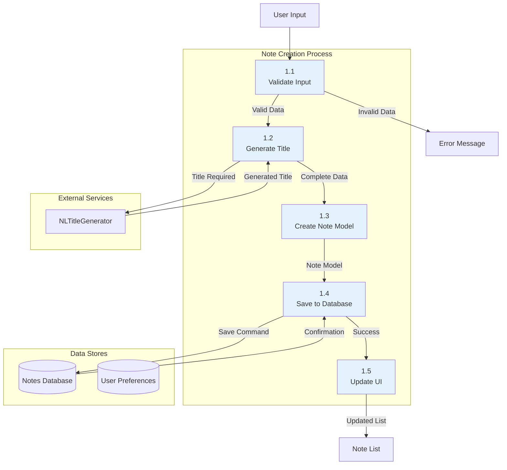
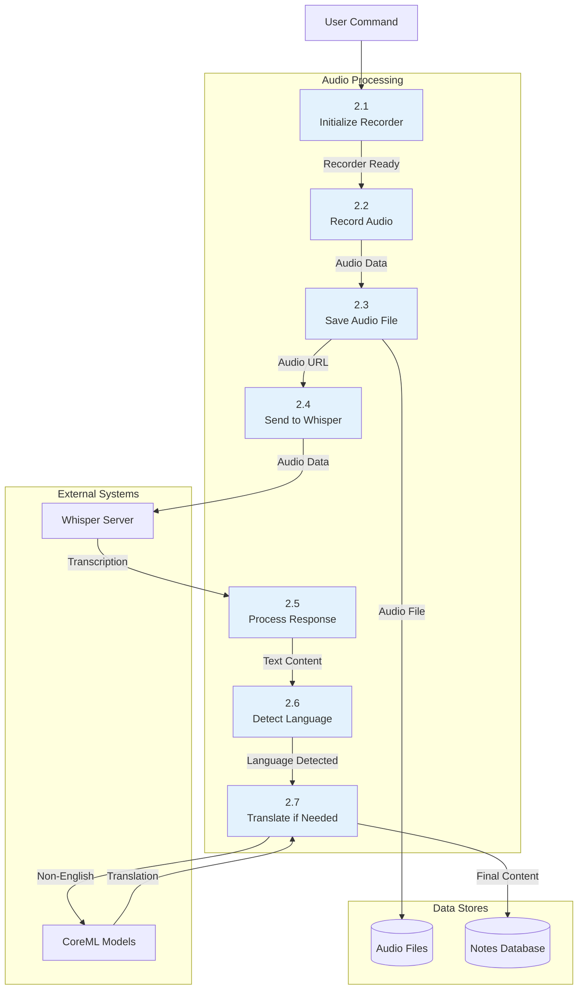
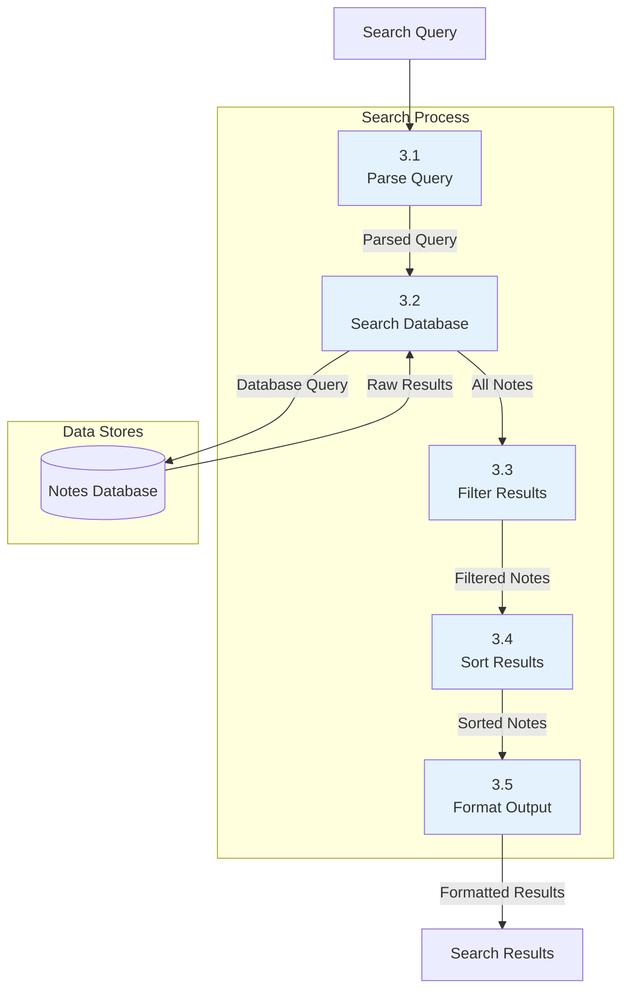

# Data Flow Diagrams (DFD) - VoiceNote

## Level 0 DFD (Context Diagram)

## Level 1 DFD (Main Processes)

## Level 2 DFD (Detailed Processes)

### Note Creation Process

### Audio Recording and Transcription Process

### Search Process

## Data Dictionary

### Data Stores
- **Notes Database:** SwiftData persistent store containing NoteModel entities
- **Audio Files:** Local file system storage for recorded audio files
- **User Preferences:** App settings and user preferences

### Data Flows
- **User Input:** Text, audio commands, and search queries from user
- **Note Data:** Complete note information including title, content, audio, transcription, and translation
- **Audio Data:** Raw audio recordings and processed audio files
- **Transcription Data:** Text generated from audio recordings
- **Translation Data:** English translations of non-English content
- **Search Results:** Filtered and sorted note lists based on search criteria

### External Entities
- **User:** The person using the VoiceNote
- **Whisper Server:** Local server providing audio transcription services
- **CoreML Models:** Apple's machine learning framework for translation
- **Device Storage:** Local storage system for data persistence

### Key Processes
1. **Note Management:** CRUD operations for text and audio notes
2. **Audio Processing:** Recording, storage, and transcription of audio
3. **Language Processing:** Detection and translation of non-English content
4. **Search Operations:** Real-time search and filtering of notes
5. **Data Persistence:** Local storage and retrieval of all app data 