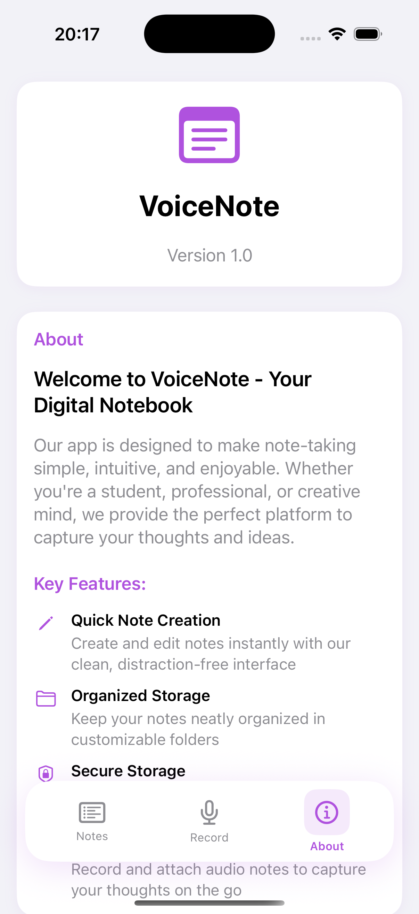
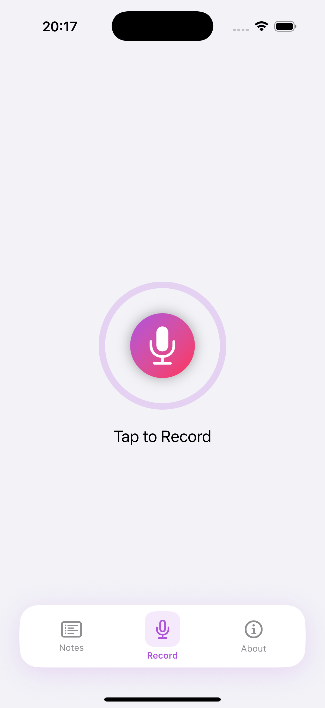

# 📝 VoiceNote App

<div align="center">
  <p><em>A modern voice-to-text note-taking application built with SwiftUI and SwiftData</em></p>
  <p style="color: #666; font-size: 0.9em;">⚠️ This is a learning project, not intended for production use</p>
</div>

## 🚀 Features

<div style="display: grid; grid-template-columns: repeat(auto-fit, minmax(300px, 1fr)); gap: 20px; margin: 20px 0;">
  <div style="background: #f8f9fa; padding: 20px; border-radius: 10px; box-shadow: 0 2px 4px rgba(0,0,0,0.1);">
    <h3>📝 Note Management</h3>
    <ul>
      <li>Create, edit, and delete notes</li>
      <li>Rich text formatting</li>
      <li>Pin important notes</li>
      <li>Search functionality</li>
    </ul>
  </div>

  <div style="background: #f8f9fa; padding: 20px; border-radius: 10px; box-shadow: 0 2px 4px rgba(0,0,0,0.1);">
    <h3>🎤 Voice Recording</h3>
    <ul>
      <li>Record voice notes</li>
      <li>Playback controls</li>
      <li>Audio file management</li>
      <li>Real-time transcription</li>
    </ul>
  </div>

  <div style="background: #f8f9fa; padding: 20px; border-radius: 10px; box-shadow: 0 2px 4px rgba(0,0,0,0.1);">
    <h3>🤖 AI Features</h3>
    <ul>
      <li>Speech-to-text conversion</li>
      <li>Multi-language support</li>
      <li>Smart text processing</li>
      <li>Natural language understanding</li>
    </ul>
  </div>
</div>

## 🛠 Technical Architecture

<div style="background: #f8f9fa; padding: 20px; border-radius: 10px; margin: 20px 0;">
  <h3>Architecture Overview</h3>
  <pre style="background: #fff; padding: 15px; border-radius: 5px;">
    App
    ├── Views
    │   ├── ContentView
    │   ├── SplashView
    │   ├── NoteListView
    │   ├── NoteDetailView
    │   └── Components
    ├── ViewModels
    │   ├── NoteListViewModel
    │   └── NoteDetailViewModel
    ├── Models
    │   └── NoteModel
    └── Services
        └── NoteService
  </pre>
</div>

## 📱 Screenshots

<div style="display: flex; gap: 20px; flex-wrap: wrap;">
  <div style="text-align: center;">
    
    <p>About Screen</p>
  </div>
  <div style="text-align: center;">
    
    <p>Record Screen</p>
  </div>
</div>

## 🚀 Getting Started

### Prerequisites

- Xcode 15.0+
- iOS 15.0+
- Swift 5.9+

### Installation

1. Clone the repository
```bash
git clone https://github.com/FlutterDev98/VoiceNote.git
```

2. Open the project in Xcode
```bash
cd VoiceNote
open VoiceNote.xcodeproj
```

3. Build and run the project

## 🏗 Project Structure

<div style="background: #f8f9fa; padding: 20px; border-radius: 10px; margin: 20px 0;">
  <h3>Directory Structure</h3>
  <pre style="background: #fff; padding: 15px; border-radius: 5px;">
    VoiceNote/
    ├── Views/
    │   ├── ContentView.swift
    │   ├── SplashView.swift
    │   ├── NoteListView.swift
    │   ├── NoteDetailView.swift
    │   └── Components/
    ├── ViewModels/
    │   ├── NoteListViewModel.swift
    │   └── NoteDetailViewModel.swift
    ├── Models/
    │   └── NoteModel.swift
    ├── Services/
    │   └── NoteService.swift
    └── Assets.xcassets/
  </pre>
</div>

## 📦 Dependencies

- SwiftUI
- SwiftData
- AVFoundation
- Pulsator (for UI animations)


## 🙏 Acknowledgments

- Apple for SwiftUI and SwiftData
- The Swift community for their excellent resources
