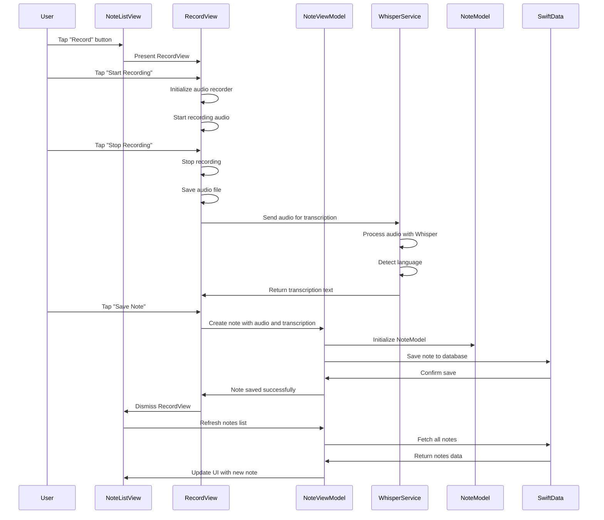
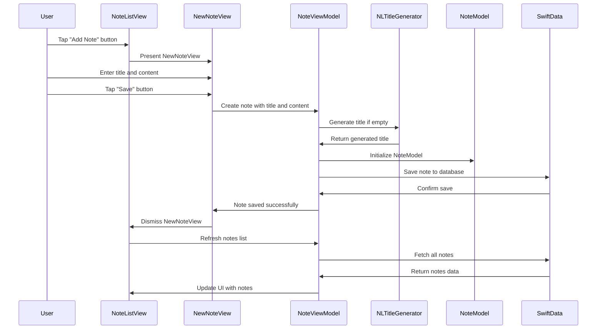
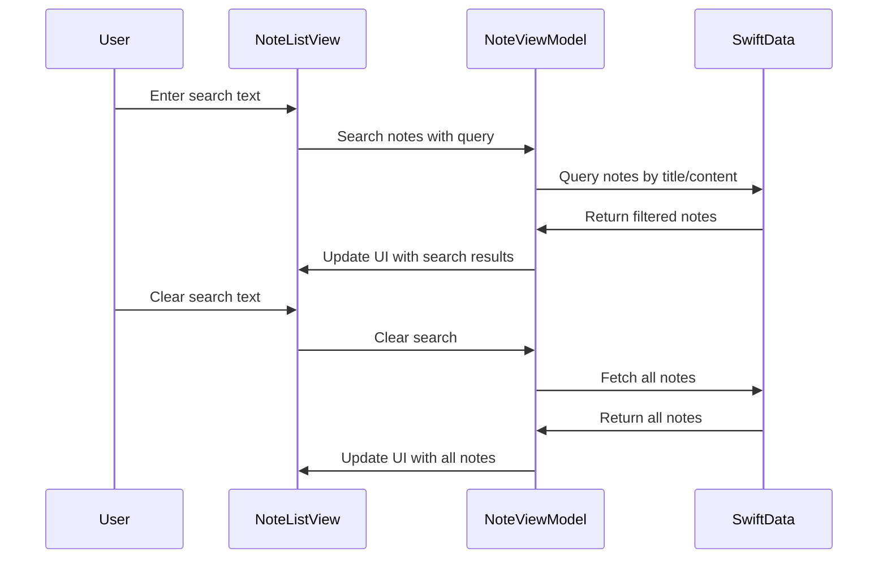
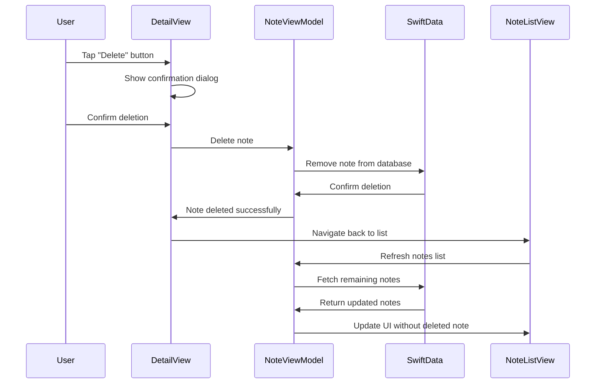
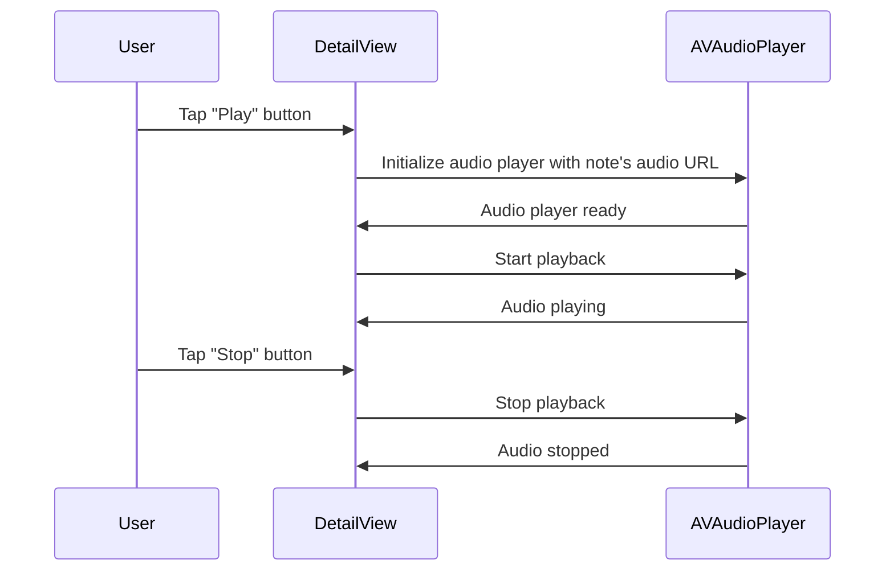
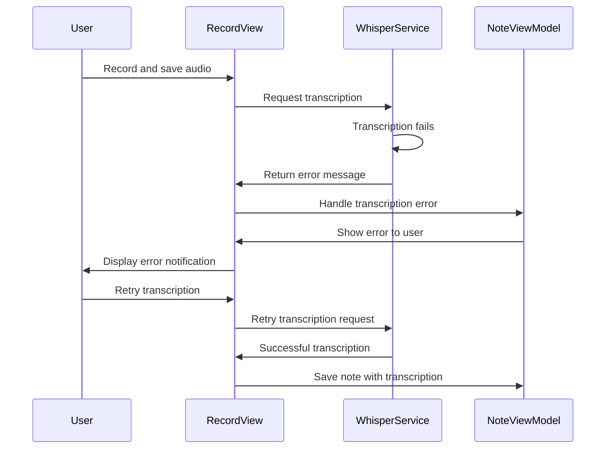

# Sequence Diagram - VoiceNote

## Audio Note Creation with Transcription Flow

## Text Note Creation Flow

## Note Search Flow

## Note Deletion Flow

## Audio Playback Flow

## Error Handling Flow

## Key Interactions Explained

### 1. Audio Note Creation
- User initiates recording through RecordView
- Audio is captured and saved locally
- WhisperService processes audio for transcription
- Note is created with both audio and transcribed text
- SwiftData persists the note

### 2. Text Note Creation
- User creates note through NewNoteView
- NLTitleGenerator may generate title if not provided
- Note is saved to SwiftData
- UI is updated to reflect new note

### 3. Search Functionality
- Real-time search as user types
- SwiftData queries filter notes by title and content
- UI updates immediately with search results

### 4. Data Persistence
- All operations go through SwiftData
- Changes are immediately persisted
- UI reflects current data state

### 5. Error Handling
- Graceful handling of transcription failures
- User-friendly error messages
- Retry mechanisms for failed operations 