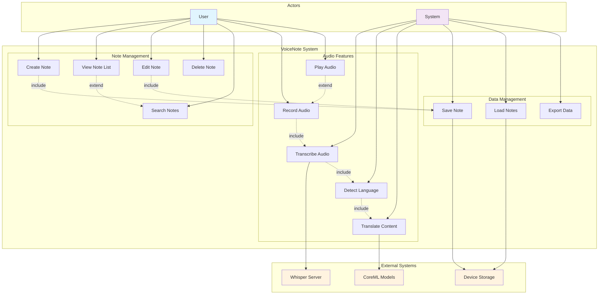

# Use Case Diagram - VoiceNote

## Use Case Descriptions

### Primary Actors
- **User:** The person using the VoiceNote to create and manage notes
- **System:** The application itself performing automated tasks

### External Systems
- **Whisper Server:** Local server providing audio transcription services
- **CoreML Models:** Apple's machine learning framework for translation
- **Device Storage:** Local storage for data persistence

### Main Use Cases

1. **Create Note (UC1)**
   - Actor: User
   - Description: User creates a new text note with title and content
   - Preconditions: App is launched and user is authenticated
   - Postconditions: New note is saved to local storage

2. **Record Audio (UC6)**
   - Actor: User
   - Description: User records audio using device microphone
   - Preconditions: Microphone permissions granted
   - Postconditions: Audio file is created and attached to note

3. **Transcribe Audio (UC8)**
   - Actor: System
   - Description: System automatically transcribes recorded audio to text
   - Preconditions: Audio file exists
   - Postconditions: Transcribed text is saved with the note

4. **Translate Content (UC10)**
   - Actor: System
   - Description: System translates non-English content to English
   - Preconditions: Non-English content is detected
   - Postconditions: Translated text is saved with the note

5. **Search Notes (UC5)**
   - Actor: User
   - Description: User searches through notes by title or content
   - Preconditions: Notes exist in the system
   - Postconditions: Matching notes are displayed 